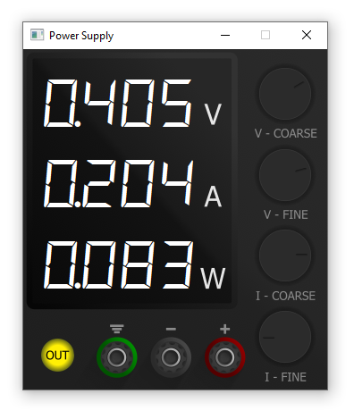

# Project Documentation

## Overview
This project aims to provide an easy-to-use interface for controlling a GPIB-controlled power supply. The system is designed to simplify the operation of the power supply while offering a user-friendly visual feedback mechanism to enhance the user experience.

## Features
- **GPIB Control**: Enables seamless communication with the power supply via the GPIB protocol.
- **Visual Feedback**: Provides real-time, intuitive visual feedback to monitor and adjust the power supply settings effectively.
- **User-Friendly Interface**: Designed to be accessible and straightforward for users of all experience levels.

## Screenshot
Below is a screenshot of the application interface (`capture.png`), showcasing the visual feedback and control layout:

## Purpose
The primary goal of this project is to streamline the process of managing a GPIB-controlled power supply, making it more accessible and efficient for users. The visual feedback ensures that users can monitor the system's status at a glance, reducing the likelihood of errors and improving overall usability.

## Usage
1. Connect the GPIB-controlled power supply to the system.
2. Launch the application.
3. Use the interface to adjust the power supply settings as needed.
4. Monitor the visual feedback to ensure proper operation.

## Future Improvements
- Support for additional GPIB devices.
- Enhanced customization options for the visual feedback system.
- Integration with logging and reporting tools for advanced monitoring.
